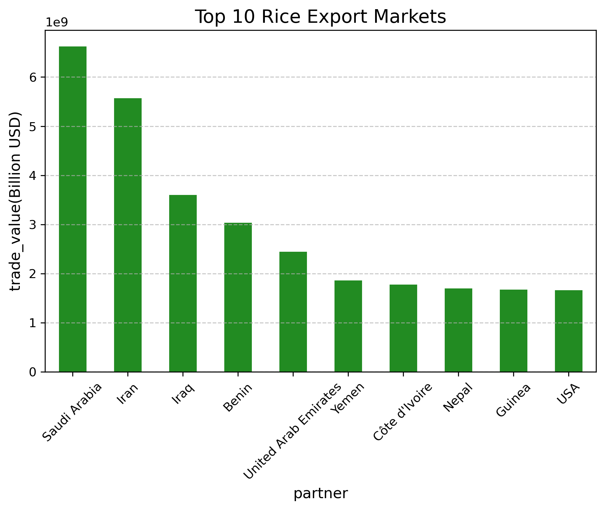
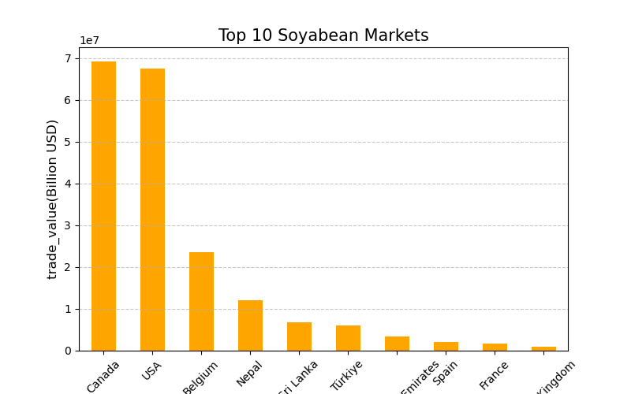
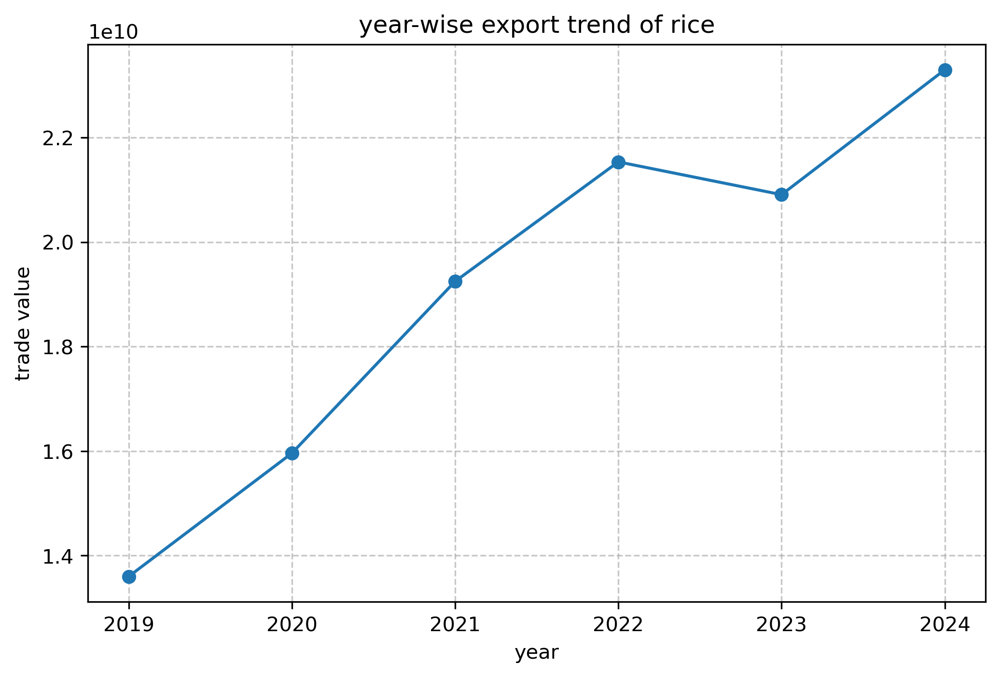
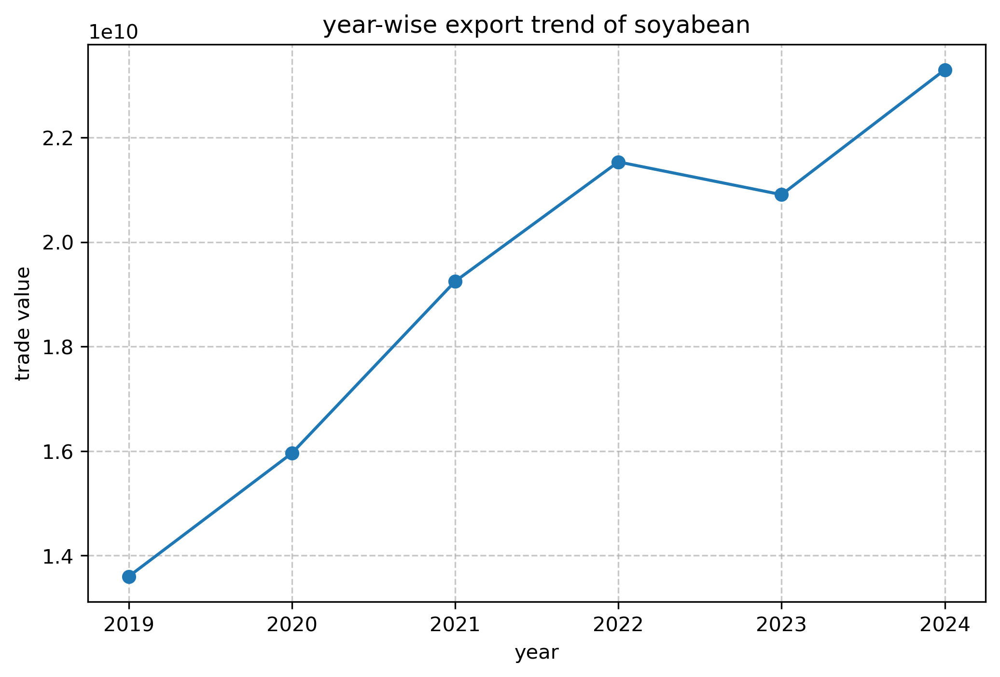
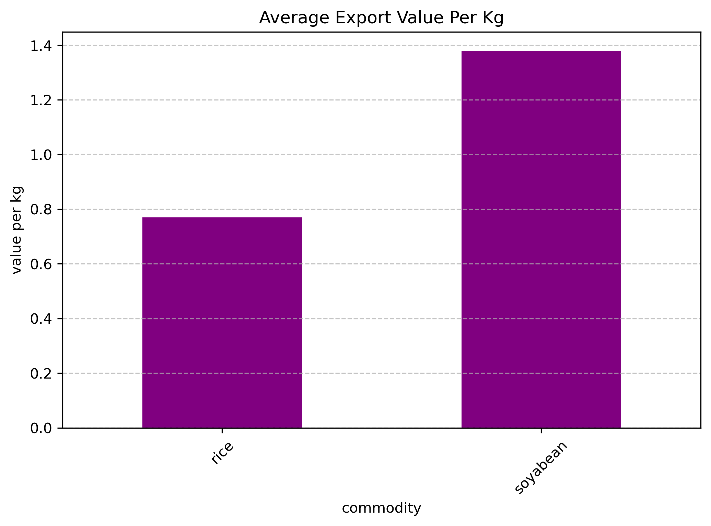

# Agricultural Export Data Analysis (Python Project)

## Project Overview

This project presents an exploratory data analysis of agricultural export data using Python. The goal is to analyze India's agricultural export performance, identify key trading partners, and compare major commodities such as Rice and Soybean.

The project focuses on trade value distribution, export destinations, and unit value (per kg) analysis to understand global demand patterns and pricing differences.

---

## Dataset Source

The dataset used in this project is obtained from:

* **UN Comtrade Database** (United Nations International Trade Statistics)
  https://comtradeplus.un.org/

This dataset provides official international trade statistics used for global trade analysis and economic research.

---

## Dataset Description

The dataset contains agricultural export records with the following attributes:

* Commodity (e.g., Rice, Soybean)
* Partner Country
* Year
* Trade Value
* Net Weight
* Value per Kg (Unit Price)

---

## Tools & Technologies Used

* Python
* Pandas
* Matplotlib
* Jupyter Notebook
* Data Cleaning & Aggregation Techniques

---

## Key Analysis Performed

### 1. Data Filtering by Commodity

The dataset was filtered to separately analyze Rice and Soybean export data.

### 2. Top Export Markets

#### Rice Export Markets (Top 10 by Trade Value)

Major importers of Rice include:

* Saudi Arabia
* Iran
* Iraq
* Benin
* United Arab Emirates
* Yemen
* Côte d'Ivoire
* Nepal
* Guinea
* USA

These markets are primarily concentrated in the Middle East, Africa, and South Asia.

#### Soybean Export Markets (Top 10 by Trade Value)

Major importers of Soybean include:

* Canada
* USA
* Belgium
* Nepal
* Sri Lanka
* Türkiye
* United Arab Emirates
* Spain
* France
* United Kingdom

Soybean exports are more distributed across North America and Europe.

### 3. Trade Value Comparison

* Rice shows significantly higher total trade value (billion-level exports)
* Soybean shows comparatively lower total trade value (million-level exports)

This highlights Rice as a dominant global staple commodity.

### 4. Value per Kg Analysis

#### Average Unit Value:

* Rice: ~0.77 per kg
* Soybean: ~1.38 per kg

## Visual Analysis

### Top 10 Rice Export Markets
### Top 10 Soyabean Export Markets
### Rice Export Markets
### Soyabean Export Markets
### Rice vs Soyabean value per kg

## Key Insights

* Rice dominates global agricultural exports in terms of total trade value.
* Soybean has a higher unit price per kg but lower total export volume.
* Export demand for Rice is highly concentrated in Middle Eastern and African countries.
* Soybean demand is stronger in developed economies such as North America and Europe.
* The analysis clearly shows a **volume vs value trade pattern**:

  * Rice → High volume, lower price
  * Soybean → Lower volume, higher price

---

## Files in This Repository

* `Agricultural_Export_Analysis.ipynb` → Main analysis notebook
* `data/` → Dataset used for analysis
* `images/` → Generated visualizations (bar charts, comparisons)
* `README.md` → Project documentation

---

## Future Improvements

* Add time-series trend analysis of exports
* Expand analysis to more commodities
* Build an interactive dashboard using Power BI or Streamlit
* Automate data cleaning and preprocessing pipeline

---

## Author

Aditi Chouksey
Agricultural Economics | Data Analytics | Agriculture Extension Officer
